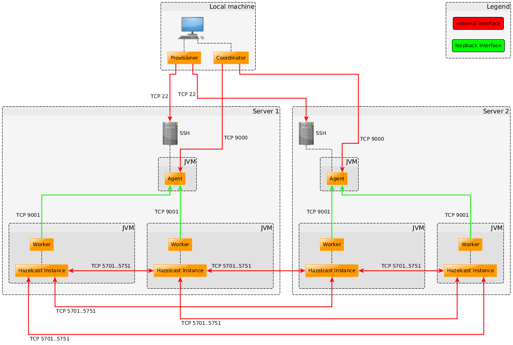

# Hazelcast Simulator

Hazelcast Simulator is a production simulator used to test Hazelcast and Hazelcast-based applications in clustered environments. 
It also allows you to create your own tests and perform them on your Hazelcast clusters and applications that are deployed to 
cloud computing environments. In your tests, you can provide any property that can be specified on these environments (Amazon EC2 or your own environment): properties such as hardware specifications, operating system, Java version, etc.

Hazelcast Simulator allows you to add potential production problems, such as real-life failures, network problems, overloaded CPU,
 and failing nodes to your tests. It also provides a benchmarking and performance testing platform by supporting performance 
 tracking and also supporting various out-of-the-box profilers.

You can use Hazelcast Simulator for the following use cases:

- In your pre-production phase to simulate the expected throughput/latency of Hazelcast with your specific requirements.
- To test if Hazelcast behaves as expected when you implement a new functionality in your project.
- As part of your test suite in your deployment process.
- When you upgrade your Hazelcast version.

Hazelcast Simulator is available as a downloadable package on the Hazelcast <a href="http://www.hazelcast.org/download" target="_blank">web site</a>. 
Please refer to the [Quickstart](#quickstart) to start your Simulator journey.

## Table of Content
- [Quickstart](#quickstart)
  * [Install](#install)
  * [Run first test locally](#run-first-test-locally)
  * [Generate charts](#generate-charts)
  * [What's next](#what-s-next)
- [Key Concepts and Terminology](#key-concepts-and-terminology)
- [Installation](#installation)
- [Define test scenario](#define-test-scenario)
  * [TestSuite configuration](#testsuite-configuration)
    + [Specify test class and number of threads per worker](#specify-test-class-and-number-of-threads-per-worker)
    + [Setting up operations frequency](#setting-up-operations-frequency)
    + [Configuring parameters](#configuring-parameters)
    + [Latency Testing](#latency-testing)
  * [Controlling the Cluster Layout](#controlling-the-cluster-layout)
    + [Set number of members and clients](#set-number-of-members-and-clients)
    + [Control distribution of workers over machines](#control-distribution-of-workers-over-machines)
      - [Default distribution algorithm](#default-distribution-algorithm)
      - [Reserving machines for members only](#reserving-machines-for-members-only)
        * [Order of the IP addresses](#order-of-the-ip-addresses)
    + [Running test against already running cluster](#running-test-against-already-running-cluster)
    + [Running test against a cluster in Hazelcast Cloud](#running-test-against-a-cluster-in-hazelcast-cloud)
  * [Controlling the Hazelcast Configuration](#controlling-the-hazelcast-configuration)
    + [IP addresses and other configuration auto-filling](#ip-addresses-and-other-configuration-auto-filling)
  * [Passing JVM options to client or member processes](#passing-jvm-options-to-client-or-member-processes)
- [Run the test](#run-the-test)
  * [Configure test duration](#configure-test-duration)
  * [Specify testSuite file to be used](#specify-testsuite-file-to-be-used)
- [Set up cluster environment](#set-up-cluster-environment)
  * [Preparations to setup remote machines](#preparations-to-setup-remote-machines)
    + [RSA key pair](#rsa-key-pair)
    + [Open ports](#open-ports)
  * [Using static setup](#using-static-setup)
  * [Using Amazon EC2](#using-amazon-ec2)
    + [Controlling provisioned machines](#controlling-provisioned-machines)
  * [Installing Simulator on remote machines](#installing-simulator-on-remote-machines)
- [Report generation](#report-generation)
  * [Basics](#basics)
  * [Generate comparison reports](#generate-comparison-reports)
  * [Extensive reports](#extensive-reports)
  * [Warmup / cooldown](#warmup---cooldown)
- [Simulator Properties reference](#simulator-properties-reference)
- [Advanced topics](#advanced-topics)
  * [Writing a Simulator test](#writing-a-simulator-test)
    + [Adding properties](#adding-properties)
    + [ThreadState](#threadstate)
    + [AfterRun and BeforeRun](#afterrun-and-beforerun)
    + [Verification](#verification)
    + [TearDown](#teardown)
    + [Total Lifecycle of Calls on the Test](#total-lifecycle-of-calls-on-the-test)
    + [Stopping a Test](#stopping-a-test)
    + [Code Generation](#code-generation)
  * [Profiling your Simulator Test](#profiling-your-simulator-test)
  * [GC analysis](#gc-analysis)
  * [Reducing Fluctuations](#reducing-fluctuations)
  * [Enabling Diagnostics](#enabling-diagnostics)
  * [Enabling Different Profilers or Other Startup Customizations](#enabling-different-profilers-or-other-startup-customizations)
  * [Logging](#logging)
  * [Running multiple tests in parallel](#running-multiple-tests-in-parallel)
  * [Coordinated Omission](#coordinated-omission)
  * [Measuring Jitter](#measuring-jitter)
  * [Controlling the load generation](#controlling-the-load-generation)
  * [Fine-grained control with Coordinator Remote](#fine-grained-control-with-coordinator-remote)
    + [Using the CLI Manual](#using-the-cli-manual)
    + [Configuring the Remote](#configuring-the-remote)
    + [Basic Usage](#basic-usage)
    + [Starting Workers](#starting-workers)
    + [Clients](#clients)
    + [Querying](#querying)
    + [Starting Tests](#starting-tests)
      - [Target Count](#target-count)
      - [Worker Type](#worker-type)
      - [Warmup and Duration](#warmup-and-duration)
    + [Stopping Test](#stopping-test)
    + [Status of a Test](#status-of-a-test)
    + [Killing Workers](#killing-workers)
    + [Executing Scripts on Workers](#executing-scripts-on-workers)
      - [Fire and Forget](#fire-and-forget)
    + [Using Custom Hazelcast Version](#using-custom-hazelcast-version)
    + [Combining Hazelcast Versions](#combining-hazelcast-versions)
    + [Rolling Upgrade Test](#rolling-upgrade-test)
      - [Resilience Testing](#resilience-testing)
    + [Tags](#tags)
  * [Using the Simulator Archetype](#using-the-simulator-archetype)
  * [Run Simulator with MongoDB](#run-simulator-with-mongodb)
- [Get Help](#get-help)

# Quickstart

This is a 5 minute tutorial where that shows you how to get Simulator running on your local machine. 
Also contains pointers where to go next.

## Install

>
> :books: Looking for all possible installation ways? Check [Installation](#installation) section.
>

1. Download Simulator ZIP file from <a href="http://www.hazelcast.org/download" target="_blank">Hazelcast web site</a>.
2. Extract the ZIP and go to the extracted directory

    ```
    unzip hazelcast-simulator-<version>-dist.zip
    cd hazelcast-simulator-<version>
    ```
   
3. Congratulations! You've successfully installed Hazelcast Simulator on the Coordinator machine.

## Run first test locally

Let's run your first Simulator test. We'll use the default example settings created by the `simulator-wizard` 
command and execute the test locally.

1. Go to the path where you want to store your test configurations
2. Create a test directory `myFirstTest` and enter it

    ```
    simulator-wizard --createWorkDir myFirstTest
    ...
    cd myFirstTest
    ```
   
3. Start the test by executing `run` script
    
   ```
   ./run
   ```
  
4. The test should successfully finish. At the end, you should see lines like:
   
   ```
   INFO  13:07:44 =========================================================================
   INFO  13:07:44 No failures have been detected!
   INFO  13:07:44 ========================================================================= 
   ```

5. Congratulations, you successfully ran Simulator for the first time! The raw output of the test is located
in the newly created directory named with a timestamp like `2021-05-21__22_59_24`.
   
   ```
   $ ls
   client-hazelcast.xml  hazelcast.xml  logs  run  test.properties  2021-05-21__22_59_24
   ```

## Generate charts

It's time to generate performance charts out of the raw data.

1. Generate report with `benchmark_report` command.

   ```
   benchmark_report 2021-05-21__22_59_24
   ```
   
2. The report is generated in the newly created `report` directory

   ```
   HTML report generated at: file:///home/jholusa/SimulatorTests/myFirstTest/report/report.html
   ```
   
3. There it is! You can look around for latency numbers, throughput, system stats and much more.

## What's next

The quickstart was to just get you up and running. In order to do some real performance testing, you'll probably need to:

* [Define test scenario](#define-test-scenario) - specify how many puts/gets to use, how many entries to preload, how big the values should be, latency vs. throughput test etc.
* [Configure cluster](#controlling-the-cluster-layout) - Hazelcast version, configuration of the Hazelcast itself, number of members and clients, number of threads per client, GC options etc.
* [Run the test](#run-the-test) - set test duration, select which test scenario to be run etc.
* [Setup the testing environment](#set-up-cluster-environment) - run it on on-premise machines, in AWS, configuring for running clusters in OpenShift, Kubernetes etc.
* [Create better charts](#report-generation) - create charts with multiple runs being compared, adjust warmup and cooldown periods, adjust legents etc.

You can use the following channels for getting help from Hazelcast:

* [Hazelcast mailing list](http://groups.google.com/group/hazelcast)
* [Slack](https://slack.hazelcast.com/) for chatting with the
  development team and other Hazelcast users.
* [Stack Overflow](https://stackoverflow.com/tags/hazelcast)

# Key Concepts and Terminology

The following are the key concepts mentioned with Hazelcast Simulator.

- **Test** - A test class for the functionality you want to test, e.g. a Hazelcast map. This test class looks similar to a JUnit 
test, but it uses custom annotations to define methods for different test phases (e.g. `@Setup`, `@Warmup`, `@Run`, `@Verify`).

- **TestSuite** - A property file that contains the name of the `Test` class and the properties you want to set on that `Test` 
class instance. A `TestSuite` contains one or multiple tests. It can also contain the same `Test` class with different names and configurations.

- **Worker** - This term `Worker` is used twice in Simulator. 

  - **Simulator Worker** - A Java Virtual Machine (JVM) responsible for running the configured `Tests`. It can be configured to 
  spawn a Hazelcast client or member instance, which is used in the tests. We refer to this `Worker` in the context of a Simulator 
  component like `Agent` and `Coordinator`.
  
  - **Test Worker** - A Runnable implementation to increase the test workload by spawning several threads in each `Test` instance. 
  We refer to this `Worker` in the context of a `Test`, e.g. how many worker threads a `Test` should create.

- **Agent** - A JVM responsible for managing client and member `Workers`. There is always one `Agent` per physical machine, no
 matter how many `Workers` are spawned on that machine. It serves as communication relay for the `Coordinator` and monitoring 
 instance for the `Workers`.

- **Coordinator** - A JVM that can run anywhere, such as on your local machine. The `Coordinator` is actually responsible for 
running the `TestSuite` using the `Agents` and `Workers`. You configure it with a list of `Agent` IP addresses, and you run it by
executing a command like "run this testsuite with 10 member worker and 100 client worker JVMs for 2 hours".

- **Coordinator Machine** - a machine on which you execute the `Coordinator` (see above). This is the place typically where the user interacts
with Simulator commands. Typically your local computer but can be installed anywhere.

- **Coordinator Remote** - A JVM that can run anywhere, such as on your local machine. The `CoordinatorRemote` is responsible for
 sending instructions to the Coordinator. For basic simulator usages the remote is not needed, but for complex scenarios such 
 as **rolling upgrade** or **high availability** testing, a much more interactive approach is required. The coordinator remote 
 talks to the coordinator using TCP/IP.

- **Provisioner** - Spawns and terminates cloud instances, and installs Hazelcast Simulator on the remote machines. It can be used 
in combination with EC2 (or any other cloud), but it can also be used in a static setup, such as a local machine or a cluster of 
machines in your data center.

- **Failure** - An indication that something has gone wrong. Failures are picked up by the `Agent` and sent back to the `Coordinator`.

- **simulator.properties** - The configuration file you use to adapt the Hazelcast Simulator to your business needs (e.g. cloud 
provider, SSH username, Hazelcast version, Java profiler settings).

# Installation

Hazelcast Simulator needs a Unix shell to run. Ensure that your local and remote machines are running under Unix, Linux or Mac OS. 
Hazelcast Simulator may work with Windows using a Unix-like environment such as Cygwin, but that is not officially supported at the moment.

In order to run Simulator tests, you need to install it on a machine which you'll then use
to execute all the Simulator commands. Simulator will orchestrate the rest. 

The local machine will be the one on which you will eventually execute the Coordinator to run your TestSuite. It is also the 
source to install Simulator on your remote machines.

Hazelcast Simulator is provided as a separate downloadable package, in `zip` or `tar.gz` format. You can download either one 
[here](http://hazelcast.org/download/#simulator).

After the download is completed, follow the below steps.

- Unpack the `tar.gz` or `zip` file to a folder that you prefer to be the home folder for Hazelcast Simulator. The file 
extracts with the name `hazelcast-simulator-<`*version*`>`. If your are updating Simulator you are done and can skip the 
following steps.

- Configure the environment by either one of the following steps.

  - Run the configuration wizard from the extracted folder.

    ```
    ./<extracted folder path>/bin/simulator-wizard --install
    ```  

  OR

  - Add the following lines to the file `~/.bashrc` (for Unix/Linux) or to the file `~/.profile` (for Mac OS).

    ```
    export SIMULATOR_HOME=<extracted folder path>/hazelcast-simulator-<version>
    PATH=$SIMULATOR_HOME/bin:$PATH
    ```

- Open a new terminal to make your changes in `~/.bashrc` or `~/.profile` effective. Call the Simulator Wizard with the `--help` 
option to see if your installation was successful.

  ```
  simulator-wizard --help
  ```
  
  
# Define test scenario 

This section describes how you can control *what* the test should do - should it do only PUTs or also GETs and if so,
in which ratio? Or should it execute SQL queries etc.?  

## TestSuite configuration

The TestSuite defines the Simulator Tests which are executed during the Simulator run. 
The TestSuite configuration is a simple properties file which contains `key = value` pairs. The common 
name of the file is `test.properties` which is also the default (e.g. generated by `simulator-wizard` as seen in [Quickstart](#quickstart)).

> We will use `test.properties` file name through the rest of the documentation for the TestSuite configuration. However,
> the file can be named arbitrarily. See [Specify TestSuite file to be used](#specify-testsuite-file-to-be-used) section on details how to specify
> different properties file.

When you open up the default (generated by `simulator-wizard`) `test.properties` file, you'll see:

```
class = com.hazelcast.simulator.tests.map.IntByteMapTest
threadCount = 10

getProb = 0.9
putProb = 0.1

keyCount = 1000
```

Let's explain the lines one by one. 

### Specify test class and number of threads per worker

The first two properties are built-in "magic" properties of Simulator.

| Property      | Example value                                      | Description |
| ---------     | -------------------------------------------------- | ------------|
| `class`       | `com.hazelcast.simulator.tests.map.IntByteMapTest` | Defines the fully qualified class name for the Simulator Test. Used to create the test class instance on the Simulator Worker. This is the only mandatory property which has to be defined.    |
| `threadCount` | `5`                                                | Defines how many threads are running in parallel the Test methods. In other words, defines the number of worker threads for Simulator Tests which use the `@RunWithWorker` annotation.         |

> :books: For details about available values for `class`, refer to [Selecting a test class]() section.

### Setting up operations frequency

Secondly, there's a group of properties with special meaning which name of ends
with `Prob` (short for "probability"), such as `getProb` and `putProb`. 

The property conforms to a format `<methodName>Prob = <probability>`, where:

* `<probability>` is a float number from `0` to `1` that sets a probability of execution of the method (see below). 
For example, probability of `0.1` means 10 % probability.

* `<methodName>` corresponds to the name of a timestep method (a method annotated with `@TimeStep` annotation) in the test class 
configured with `class` property. For example, the `com.hazelcast.simulator.tests.map.IntByteMapTest` test contains following methods:

  ```
  @TimeStep
  public void put(ThreadState state) {
    map.put(state.randomKey(), state.randomValue());
  }
  
  @TimeStep
  public void get(ThreadState state) {
    map.get(state.randomKey());
  }
  ```

As a complete example, the `putProb = 0.1` property sets the probability of execution of the `put` method to 10 %. 
In other words, out of all the things being done by the test, 10 % will be PUTs. This is the basic way how to control the ratio of operations. 
For example, if you want to execute 80 % GETs and 20 % PUTs with `IntByteMapTest` you would set `getProb = 0.8` and `putProb = 0.2`.

A special case of probability value is `-1` which means "calculate the remaining probability to 1". Example:

```
putProb = 0.1
setProb = 0.2
getProb = -1
```

Above properties result in 10 % PUT operations, 20 % SET operation and (`1-0.1-0.2=0.7`) 70 % of GET operations.

### Configuring parameters

All the other properties are values passed directly to the test class and are usually used for adjusting 
parameters of the test such as number of entries being preloaded in the Map, size of the value etc. Each test class
has its own of such options, so you have to look at the source code of the test class for the available parameters 
and their meeting.

The property must match a public field in the test class. If a defined property cannot be found in the Simulator Test 
class or the value cannot be converted to the according field type, a BindException is thrown. If there is no property defined 
for a public field, its default value will be used.  

Let's continue using `com.hazelcast.simulator.tests.map.IntByteMapTest` as an example. 
It contains following public fields:

```
public class IntByteMapTest extends HazelcastTest {
    public int keyCount = 1000;    
    public int minSize = 16;
    public int maxSize = 2000;
    ... and more
}
``` 

Hopefully the names of the properties are self-explanatory. Therefore, if we wanted to change the test scenario
and preload 1 million entries with value size exactly 10 KB, we would edit `test.properties` file in a following way:

```
class = com.hazelcast.simulator.tests.map.IntByteMapTest

# probabilites and thread count settings

keyCount = 1000000
minSize = 10000
maxSize = 10000
```

### Latency Testing

> In general, when doing performance testing, you should always distinguish between throughput and latency testing.
> * **Throughput test** - stress out the system as much as possible and get as many operations per second as possible.
> * **Latency test** - measure operation latencies while doing _a fixed number of operations per second_. 

By default the timestep-threads operate in throughput testing mode - they will loop over the timestep methods as fast as they can. 
As a bonus you get an impression of the latency for that throughput. 
However, for a proper latency test, you want to control the rate and measure the latency for that rate. Luckily using the Simulator this is very easy.

You can configure the fixed number of operations per second using following properties in `test.properties`:

* `ratePerSecond=<X>` - where `<X>` is a desired number of operations per second **load generating client/member** (not worker thread!). 
Example: if in your test, you configure 5 clients and you want to stress the cluster
by 500 000 operations per second, you set `ratePerSecond=100000`, because 5 clients times 100 000 ops = desired 500 K ops.  

* `interval=<Y>` - where `<Y>` is the time interval between subsequent calls **load generating client/member** (not worker thread!).
Example: if in your test, you configure 5 clients and you want to stress the cluster
by 500 000 operations per second, you set `interval=100us`, because 5 clients times 100 000 ops = desired 500 K ops.

> Possible time units in `interval` property:
> * `ns` - nanoseconds
> * `us` - microseconds
> * `ms` - milliseconds
> * `s` - seconds
> * `m` - minutes
> * `h` - hours
> * `d` - days

> :books: From the descriptions above, you can see that if you set the number of operations per second, different values of the `threadCount` 
> property don't affect it. The formulas are:
> * `number of clients` * `ratePerSecond` = `total number of operations per second`
> * `number of clients` * `(1000 / interval_in_ms)` = `total number of operations`
>
> Both ways do exactly the same and it's just a matter of preference which one you use.  

## Controlling the Cluster Layout

Hazelcast has two basic instance types: member and client. The member instances form the cluster and client instances connect to 
an existing cluster. Hazelcast Simulator can spawn Workers for both instance types. You can configure the number of member and 
client Workers and also their distribution on the available remote machines. 

> :books: To see how Simulator can help with setting up remote machines, refer to the [Set up cluster environment](#Set up cluster environment) section.

> All configuration about the cluster layout is done through the `coordinator` command which is usually
> called from the `run` script (as for example created in [Quickstart](#quickstart)).

### Set number of members and clients

Use the options `--members` and `--clients` to control how many member and client Workers you want to have. The following command 
creates a cluster with four member Workers and eight client Workers (which connect to that cluster).

```
coordinator --members 4 --clients 8
```

A setup without client Workers is fine, but out of the box it won't work without member Workers.

### Control distribution of workers over machines

Through this section, we'll assume that we have 3 remote machines that we're going to use. In other words,
there are 3 IP addresses specified in the `agents.txt` like this:

```
10.0.0.1
10.0.0.2
10.0.0.3
```

> :books: To find out what is the `agents.txt` file and how to get remote machines setup, refer to [Set up cluster environment](#set-up-cluster-environment) section.

#### Default distribution algorithm

The Workers will be distributed among the available remote machines with a round robin selection. First the members are distributed in the round robin
fassion (going through the IP addresses from the top to the bottom). Once there are no more members to be distributed, Simulator
continues (= **not** starting from the first IP address but continuing with the next one) with distribution of the
 clients. 
 By default, the machines will be mixed with member and client Workers. Let's see couple of examples.

| Coordinator arguments | Cluster layout |
| --- | --- |
| `--members 1 --clients 1` | <pre>10.0.0.1 - members:  1, clients:  0<br>10.0.0.2 - members:  0, clients:  1<br>10.0.0.3 - members:  0, clients:  0</pre> |
| `--members 1 --clients 2` | <pre>10.0.0.1 - members:  1, clients:  0<br>10.0.0.2 - members:  0, clients:  1<br>10.0.0.3 - members:  0, clients:  1</pre> |
| `--members 1 --clients 3` | <pre>10.0.0.1 - members:  1, clients:  1<br>10.0.0.2 - members:  0, clients:  1<br>10.0.0.3 - members:  0, clients:  1</pre> |
| `--members 2 --clients 2` | <pre>10.0.0.1 - members:  1, clients:  1<br>10.0.0.2 - members:  1, clients:  0<br>10.0.0.3 - members:  0, clients:  1</pre> |
| `--members 4 --clients 2` | <pre>10.0.0.1 - members:  2, clients:  0<br>10.0.0.2 - members:  1, clients:  1<br>10.0.0.3 - members:  1, clients:  1</pre> |

#### Reserving machines for members only

You can reserve machines for members only (which is a Hazelcast recommended setup) using:

```
coordinator --dedicatedMemberMachines 2
```

The algorithm that takes the first 2 IP addresses and distributes the members only across them in a round robin fassion.
Then takes the rest of the IP addresses and distributes the clients across them, again in the round robin fassion. 
Continuing our [example](#control-distribution-of-workers-over-machines):

| Coordinator arguments | Cluster layout |
| --- | --- |
| `--members 2 --clients 4 --dedicatedMemberMachines 1` | <pre>10.0.0.1 - members:  2, clients:  0<br>10.0.0.2 - members:  0, clients:  2<br>10.0.0.3 - members:  0, clients:  2</pre> |
| `--members 3 --clients 4 --dedicatedMemberMachines 2` | <pre>10.0.0.1 - members:  2, clients:  0<br>10.0.0.2 - members:  1, clients:  0<br>10.0.0.3 - members:  0, clients:  4</pre> |

You cannot specify more dedicated member machines than you have available. If you define client Workers, there must be at least 
a single remote machine left (e.g. with three remote machines you can specify a maximum of two dedicated member machines). 

> If you need more control over the cluster layout, you can make use of the `coordinator-remote` which allows full control on 
layout, versions of clients, servers, etc., refer to the [Fine-grained control with Coordinator Remote](#fine-grained-control-with-coordinator-remote) section.

##### Order of the IP addresses

The order of the IP addresses matters. Simulator goes from the top to the bottom and applies the algorithm described above
deterministically and always the same.

That allows you to fine tune the configuration of the environment. Imagine a typical usecase where you want to run
the members on more powerful machines (e.g. more CPUs, more memory) and use lighter and cheaper (e.g. in the cloud) machines
for the clients.

Example: Suppose you have available 3 "big" machines `10.0.0.3-10.0.0.5` that you want use for 6 members, two members per
machine and you have 4 "light" machines `10.0.1.1-10.0.1.4` that you want to use for 8 clients. Following command
 and `agents.txt` file achieves this setup:

```
coordinator --members 6 --clients 8 --dedicatedMemberMachines 2 ...
```

```
$ cat agents.txt
10.0.0.3
10.0.0.4
10.0.0.5
10.0.1.1
10.0.1.2
10.0.1.3
10.0.1.4
```

> :warning: Running multiple members on a single machines is a Hazelcast performance anti-pattern and should be avoided. 
> We used it only for a demonstration of the cluster layout distribution.
> Consult [Hazelcast documentation](https://docs.hazelcast.com) for more information about recommended setup.

### Running test against already running cluster

There are cases where you already have a running cluster and you want to execute performance test against it.
In other words, you don't want the Simulator to manage your members but only orchestrate the clients. 
In order to do this, you have to:

* Specify `--members` to `0` - Simulator will not care about members at all, won't control their lifecycle etc.
* Put member IP addresses in the `client-hazelcast.xml` - since Simulator doesn't control the member lifecycle, it 
can't possibly know the IP addresses of the members. Therefore, you have to manually provide it through editing the client
configuration. For more information about this, refer to [Controlling the Hazelcast configuration](#controlling-the-hazelcast-configuration).
* Specify correct `<cluster-name>` in the `client-hazelcast.xml` - for the same reason as with IP addresses,
you have to adjust the `<cluster-name>` configuration to match the one in the running cluster.

### Running test against a cluster in Hazelcast Cloud

If you want to test the performance of the Hazelcast Cloud managed cluster, you follow the same setup as
described in [Running test against already running cluster](#running-test-against-already-running-cluster) section
with minor difference:

* Specify correct cluster name and enter the Cloud discovery token through like this: 
```
<hazelcast-client>
  <cluster-name>YOUR_CLUSTER_NAME</cluster-name>
  
  <network>
    <hazelcast-cloud enabled="true">
        <discovery-token>YOUR_CLUSTER_DISCOVERY_TOKEN</discovery-token>
    </hazelcast-cloud>
  </network>
</hazelcast-client>
``` 
in `client-hazelcast.xml`.

## Controlling the Hazelcast Configuration

You can specify Hazelcast configuration by placing a `hazelcast.xml` (member configuration) or `client-hazelcast.xml` (client configuration) in your working directory
(the one from which you're executing the `run` script or `coordinator` command). Simulator will handle the upload of them and makes sure that the
workers are started with them transparently.

If there's no `hazelcast.xml` or `client-hazelcast.xml` in the working directory, Coordinator uses the default files `${SIMULATOR_HOME}/conf/hazelcast.xml` and `${SIMULATOR_HOME}/conf/client-hazelcast.xml`.

> The recommended approach is to either copy the default XML configurations (listed above) into your working directory and
then modify them, or use the generated ones by `simulator-wizard` as shown in [Quickstart](#quickstart). 
> The reason are the auto-filling markers described below. 

### IP addresses and other configuration auto-filling

When you look at the default `hazelast.xml` or `client-hazelcast.xml` configurations (described above),
you'll probably notice the following comment:

```
<hazelcast>
...
    <network>
        <join>
            <multicast enabled="false"/>
            <tcp-ip enabled="true">
                <!--MEMBERS-->   <------ THIS
            </tcp-ip>
        </join>
    </network>
</hazelcast>
```

This comment is actually a marker of Simulator where it then automatically places the IP addresses
of the members. Therefore, you don't have to care about it which greatly simplifies the testing.

In general, do not remove this comment or put member IP address manually if you let Simulator handle
the member lifecycle as well (= most of the time, everytime the `--members` is greater than zero). 

See [Running test against already running cluster](#running-test-against-already-running-cluster) for an
example when editing this section is actually desired.

## Passing JVM options to client or member processes

Often you need to pass additional JVM arguments to the client or member processes such as enabling GC
logging, enabling JFR or passing other useful arguments like `-Dhazelcast.partition.count` for Hazelcast partition count.
You can achieve this simply via `coordinator --memberArgs` and `coordinator --clientArgs`. Complete example:

```
gcArgs="-verbose:gc -Xloggc:verbosegc.log"
gcArgs="${gcArgs} -XX:+PrintGCTimeStamps -XX:+PrintGCDetails -XX:+PrintTenuringDistribution -XX:+PrintGCApplicationStoppedTime -XX:+PrintGCApplicationConcurrentTime"

memberJvmArgs="-Dhazelcast.partition.count=${partitions}"
memberJvmArgs="${memberJvmArgs} -Dhazelcast.health.monitoring.level=NOISY -Dhazelcast.health.monitoring.delay.seconds=${monitorSec}"
memberJvmArgs="${memberJvmArgs} -Xmx${memberHeapSZ} -XX:+HeapDumpOnOutOfMemoryError"
memberJvmArgs="${memberJvmArgs} ${gcArgs}"

clientJvmArgs="-Xmx${clientHeapSZ} -XX:+HeapDumpOnOutOfMemoryError"
clientJvmArgs="${clientJvmArgs} ${gcArgs}"

coordinator --members ${members} \
            --clients ${clients} \
            --duration ${duration} \
            --memberArgs "${memberJvmArgs}" \
            --clientArgs "${clientJvmArgs}" \
            --driver hazelcast4 \
            --version maven=4.2 \
             ${testsuite}.properties
```


# Run the test

The actual Simulator Test run is done by the `coordinator` command. The created `run` script (via `simulator-wizard` in [Quickstart](#quickstart)) 
is a good start to customize your test setup. 

It takes four optional parameters to define the number of member and client Workers, the run duration and the name of the TestSuite file. 
So the following command will spawn 4 member Workers, twenty 20 Workers and will run for five minutes (with the default `test.properties` file).
 
 ```
 ./run 4 20 5m
 ```

## Configure test duration

You can control the duration of the test execution by using the `--duration` argument of `coordinator` command. 
You can specify the time unit for this argument by using

- `s` for seconds
- `m` for minutes
- `h` for hours
- `d` for days

If you omit the time unit the value will be parsed as seconds. The default duration is 60 seconds. 

You can see the usage of the `--duration` argument in the following example commands.

```
coordinator --duration 90s
coordinator --duration 3m
coordinator --duration 12h
coordinator --duration 2d
```

The duration is used as the run phase of a Simulator Test (that's the actual test execution). If you have long running warmup or
 verify phases, the total runtime of the TestSuite will be longer.

> :books: There is another option for the use case where you want to run a Simulator Test until some event occurs (which is not time bound), 
> e.g. stop after five million operations have been done. In this case, the test code must stop the `TestContext` itself. See [Stopping a test](#stopping-a-test) section.

> If you want to run multiple tests in parallel, please refer to [Running multiple tests in parallel](#running-multiple-tests-in-parallel) section.

## Specify testSuite file to be used

You can specify the used TestSuite file by passing it directly to the `coordinator` command. 

```
coordinator small-testsuite.properties
```

This is very convenient when you want to test multiple test scenarios on a same cluster setup.

# Set up cluster environment

In the [Quickstart](#quickstart), we executed the test on the local machine. This is usually useful for
[developing Simulator test itself](#writing-a-simulator-test), but very rarely for the real performance testing.
In general, you want to execute the performance tests in the as real (= production) as possible environment and 
in order to do that, you'll most likely need to execute the tests on remote machines other than your local.

Simulator can help with that. Not only it can automatically installs Simulator and Hazelcast itself, it
 e.g. provision of the machines directly in the cloud, install Java on those machines etc. 
 
This chapter goes in detail through all the possible means that Simulator offers in that regard.

## Preparations to setup remote machines

For setups on remote machines, you only need:
* **RSA key pair** - a RSA public/private key pair to be used for passphrase-less SSH access to the remote machines.  
* **Open ports** - you may also need to configure the firewall between the Coordinator machine (typically your local)
 and the remote machines.
 
### RSA key pair 

The preferred method for password free authentication is using an RSA public/private key pair. 
The RSA key should not require you to enter the passphrase manually. 

> A key with a pass-phrase and ssh-agent-forwarding is strongly recommended for security purposes, 
> but a key without a pass-phrase also works (you'll usually use this option during getting started phase).

If you already have an RSA key pair, you will find the files `id_rsa.pub` and `id_rsa` in your local `~/.ssh` folder. If you do 
not have RSA keys, you can generate a public/private key pair using e.g. this [tutorial](https://docs.oracle.com/cd/E19683-01/806-4078/6jd6cjru7/index.html).

### Open ports

Please ensure that all remote machines are reachable via TCP ports 22, 9000 and 5701 to 57xx on their external network interface 
(e.g. `eth0`). The first two ports are used by Hazelcast Simulator. The other ports are used by Hazelcast itself. Ports 9001 to 
90xx are used on the loopback device on all remote machines for local communication.



- Port 22 is used for SSH connections to install Simulator on remote machines, to start the Agent and to download test result and 
log files. If you use any other port for SSH, you can configure Simulator to use it via the `SSH_OPTIONS` property in the `simulator.properties` file (for details, see [simulator.properties](#simulator-properties) section).
- Port 9000 is used for the communication between Coordinator and Agent. You can configure this port via the `AGENT_PORT` property 
in the `simulator.properties` file (for details, see [simulator.properties](#simulator-properties) section).
- Ports 9001 to 90xx are used for the communication between Agent and Worker. We use as many ports as Worker JVMs are spawned 
on the machine.
- Ports 5701 to 57xx are used for the Hazelcast instances to form a cluster. We use as many ports as Worker JVMs are spawned on
 the machine, since each of them will create its own Hazelcast instance.

## Using static setup

By static setup we mean a situation where you have a fixed list of given remote machines, e.g. your local machines or a test laboratory
 which are already up and running and you want to run the tests on them. 
 Having installed Simulator locally, this section describes how to prepare Simulator for testing a Hazelcast cluster on these machines.

1. Create a working directory for your Simulator TestSuite. Use the Simulator Wizard to create an example setup for you and change
 into the directory.

    ```
    simulator-wizard --createWorkDir myStaticTest --cloudProvider static
    cd myStaticTest
    ```

2. Create a `agents.txt` file and add the IP addresses of your remote machines to it, one address per line.

    ```
    $ cat agents.txt
    192.0.1.1
    192.0.1.2
    ```

    You can also configure a different public and private IP address per machine. In such case, use `<public_ip>,<private_ip>` per line. 
    In the below example, 192.0.1.1 is the public and 172.16.16.1 the private IP address).

    ```
    $ cat agents.txt
    192.0.1.1,172.16.16.1
    192.0.1.2,172.16.16.2
    ```

    The public IP address will be used to connect to the remote machines via SSH. 
    The private IP address will be used by Hazelcast to form a cluster.

3. The default username for SSH access used by Hazelcast Simulator is `simulator`. You can change this via the `SIMULATOR_USER` property in the `simulator.properties` file in your working folder.

    ```
    SIMULATOR_USER=preferredUserName
    ```

    Ensure that a user account with this name exists on all configured remote machines.

4. Ensure you have appended your public RSA key (`id_rsa.pub`) to the `~/.ssh/authorized_keys` file on all remote machines in order to gain password-less
SSH access. Simulator Wizard can create a script to copy the RSA key to all machines in your `agents.txt` file and you simply execute it:

    ```
    simulator-wizard --createSshCopyIdScript
    ./ssh-copy-id-script
    ```

5. You can check if the SSH connection for all remote machines work as expected using the following command.

    ```
    simulator-wizard --sshConnectionCheck
    ```

6. Install Simulator itself on the remote machines using following command:

    ```
    provisioner --install
    ```
   
7. Your static setup is ready. You can now execute the test by running the `run` script just like
in [Quickstart](#quickstart) or in [Run the test](#run-the-test).

> For more information about how to customize the parameters of the connection, refer to the [simulator.properties](#simulator-properties)
> section.

## Using Amazon EC2

Hazelcast Simulator provides out of the box support to create and terminate Amazon EC2 instances for convenience which
greatly simplifies the testing. Of course, you can always create the EC2 instances yourself and then set them up as
described in [Setting up for static setup](#setting-up-for-static-setup).

This section describes how to leverage Simulator's capabilities of handling the provisioning in Amazon EC2 for you.

1. [Install](https://docs.aws.amazon.com/cli/latest/userguide/install-cliv2.html)
   and [configure](https://docs.aws.amazon.com/cli/latest/userguide/cli-configure-quickstart.html) aws-cli using your
   AWS credentials. In the case of SSO enabled you need to
   perform [additional steps](https://docs.aws.amazon.com/cli/latest/userguide/cli-configure-sso.html)

2. Create a working directory for your Simulator TestSuite. Use the Simulator Wizard to create an example setup for you
   and change to that directory.

    ```
    simulator-wizard --createWorkDir myCloudTest --cloudProvider aws-ec2
    cd myCloudTest
    ```

3.  Execute the created `prepare` script to create the EC2 instances and install Simulator on them.

    ```
    ./prepare
    ```

4. Execute the created `run` script to run the TestSuite.

    ```
    ./run
    ```

5. Execute the following command to destroy the created EC2 instances.

   ```
   provisioner --terminate
   ```

6. Your cloud setup is ready. You can now execute the test by running the `run` script just like
in [Quickstart](#quickstart) or in [Run the test](#run-the-test).

### Controlling provisioned machines

Simulator provides out of the box support for Amazon EC2 for convenient controlling of the provisioned machiens
using the `provisioner` command. The provisioning is highly configurable through `simulator.properties` file.
This section describes some of the goodies it can help you out with.

* **Control the flavour of created instances** - all the following properties are added to the `simulator.properties` file
in a `property=value` format. All the subseqent calls of `provisioner` (or any other Simulator command such as `coordinator`) load the properties file
and customize the behavior according to the properties.

    | Property | Description | Example |
    | ---| --- | --- |
    |`SIMULATOR_USER` | The user to be connected with. | `SIMULATOR_USER=simulator`. |
    | `SUBNET_ID` | EC2 subnet ID to be used. | `SUBNET_ID=subnet-111111` |
    | `INSTANCE_TYPE` | EC2 instance type to be used. | `INSTANCE_TYPE=c4.xlarge` |
    | `REGION` | EC2 region to be used. | `REGION=us-east-1` |
    | `IMAGE_ID` | ID of an EC2 image to be used. | `IMAGE_ID=ami-0fc61db8544a617ed` |
    | `PLACEMENT_GROUP` | EC2 placement group for the machines. | `PLACEMENT_GROUP=simulator` | 
    
    > For full `simulator.properties` reference, refer to [Simulator Properties reference](#simulator-properties-reference).

* **Scaling up/down** - adding more machines or removing (terminating) some of them. When adding more machines, the IP 
addresses are appended to the end of the `agents.txt` file. 

    ```
    # creating 3 machines
    provisioner --scale 3
  
    # supposed that there are 3 machines existing (e.g. due to above command), 
    # following command removes one
    provisioner --scale 2
    ```

* **Terminate all machines** - immediately terminates all the machines that are listed in the `agents.txt`.

    ```
    provisioner --terminate
    # or (= equivalent to)
    provisioner --scale 0
    ``` 
  
* **Stopping all remote processes** - if your test run hangs for any reason you can kill all Java processes on the remote machines with the following command:
      
    ```
    provisioner --kill
    ```

## Installing Simulator on remote machines

Simulator needs to be installed on the remote machines before you run the tests.
If you already have your cloud instances provisioned (see [Controlling provisioned machines](#controlling-provisioned-machines)) or run a `static` setup (see [Using static setup](#using-static-setup)),
you can just install Hazelcast Simulator with the following command.

```
provisioner --install
```

This is also useful whenever you update or change your local Simulator installation (e.g. when developing a test TestSuite)
and want to re-install Hazelcast Simulator on the remote machines. 

This is just necessary if the JAR files have been changed. Configuration changes in your `test.properties` or
 `simulator.properties` **don't require** a new Simulator installation.

# Report generation

Once a benchmark has been executed, an HTML report can be generated using the `benchmark_report` tool. This tool requires
Gnuplot 4+ and Python 3.x to be installed for generating the diagrams.

## Basics

Assume that a benchmark has been executed and the directory `2021-05-31__23_19_13` has been created. To create a report for that 
benchmark, you can use the following command:

```
benchmark_report -o my-benchmark-report 2021-05-31__23_19_13
```

The name `my-benchmark-report` is output directory's name. The generated report contains detailed throughput and latency information. 
If `dstats` information is available, it shows detailed information about resource utilization such as network, CPU, and memory.

## Generate comparison reports

The `benchmark_report` tool is also able to make comparisons between two or more benchmarks. 
Suppose that you executed a test with some configuration, the resulting directory is `2021-05-31__23_19_13`. Then you changed
the configuration, e.g. changed the Hazelcast version and executed again with resulting directory `2021-05-31__23_35_40`.  

You can create a single report plotting those two benchmarks in the same chart allowing easy comparison with:

```
benchmark_report -o my-comparison-report 2021-05-31__23_19_13 2021-05-31__23_35_40
```

## Extensive reports

You can create a very detailed report with more charts with `-f` switch:

```
benchmark_report -f -o my-full-report 2021-05-31__23_19_13 
```

## Warmup / cooldown

It's often desired to strip the beginning or the end of the test out of the resulting charts e.g. because
of JIT compiler warmup etc. 

The way how it works in Simulator is that the data is collect nevertheless. You just trim it out in the final
report generation with the `benchmark_report` command. Example having 1 minute (60 seconds) warmup and 30 second cooldown:

```
benchmark_report -w 60 -c 30 -o my-trimmed-benchmark-report 2021-05-31__23_19_13
``` 

# Simulator Properties reference

You can configure Simulator itself using the file `simulator.properties` in your working directory. The default properties are
 always loaded from the `${SIMULATOR_HOME}/conf/simulator.properties` file. Your local properties are overriding the
  defaults. 

For the full reference of available settings and their explanation, please refer to [default simulator.properties](dist/src/main/dist/conf/simulator.properties).

# Advanced topics

## Writing a Simulator test

The main part of a Simulator test is writing the actual test. The Simulator test is heavily inspired by the JUnit testing and 
Java Microbenchmark Harness (JMH) frameworks. To demonstrate writing a test, we will start with a very basic case and 
progressively add additional features. 

For the initial test case we are going to use the `IAtomicLong`. Please see the following snippet:

```java
package example;

...

public class MyTest extends AbstractTest{
  private IAtomicLong counter;

  @Setup public void setup(){
    counter = targetInstance.getAtomicLong("c");
  }

  @TimeStep public void inc(){
    counter.incrementAndGet();
  }
}
```

The above code example shows one of the most basic tests. `AbstractTest` is used to remove duplicate code from tests; so it 
provides access to a logger, `testContext`, `targetInstance` HazelcastInstance, etc. 

A Simulator test class needs to be a public, non-abstract class with a public no-arg constructor.

Assume the property file to start the test is as follows:

```
class=example.MyTest
```

The main property that needs to be in the property file is the `class` property which needs to point to the full class name.

Just like the other annotated methods, `Timestep` methods need to be public due to the code generator and they are allowed to 
throw `Throwable` like checked exceptions:

```
  @TimeStep public void inc() throws Exception{
    counter.incrementAndGet();
  }
```

Any `Throwable`, apart from the `StopException`, that is being thrown will lead to a Failure to be reported.

### Adding properties

Properties can be added to a test to make it easy to modify them from the outside. Properties must be public fields and can be 
primitives, wrappers around primitives like `java.lang.Long`, enums, strings and classes. Properties are case sensitive.

In the below example the `countersLength` property has been added and it defaults to 20.

```
public class MyTest extends AbstractTest{
  public int countersLength = 20;

  private IAtomicLong[] counters;

  @Setup public void setup(){
    this.counters = new IAtomicLong[countersLength];
    for(int k=0;k<countersLength;k++)
      counters[k] = targetInstance.getAtomicLong(""+k);
  }

  @TimeStep public void inc(BaseThreadState state){
      int counterIndex = state.randomInt(countersLength);
      counters[counterIndex].incrementAndGet();
  }
}
```

In most cases it is best to provide defaults for properties to make customization of a test less verbose.

The `countersLength` can be configured as shown below:

```
class=example.MyTest
countersLength=1000
```

The order of the properties in the file is irrelevant.

Properties do not need to be simple fields. The property binding supports complex object graphs to be created and configured.
Properties can be nested and no-arg constructor must be used to build up the graph of objects. Please see the following example:

```
public class SomeTest{
	
	pubic Config config;

	public static class Config{
		NestedConfig nestedConfig;
	}

	public static class NestedConfig{
		public int value;	
	}
}
```

The `config` object can be configured as shown below:

```
class=SomeTest
config.nestedConfig.value=10
```

If a property is not used in a test, the test fails during its startup. The reason is that if you would make a typing error and, 
in reality, something different is tested different from what you think is being tested, it is best to know this as soon as possible.

### ThreadState

A Simulator test instance is shared between all timestep-threads for that test and only on the test instance level where there
 was a state. But in some cases you want to track the state for each timestep-thread. Of course a thread-local can be used for 
 this, but the Simulator has a more practical and faster mechanism, `ThreadState`.

In the following code example, a `ThreadState` is defined that tracks the number of increments per thread:

```java
import com.hazelcast.Simulator.test.BaseThreadState
...

public class MyTest extends AbstractTest{
  public int countersLength; 

  private AtomicLong counter;

  @Setup public void setup(){
    this.counter = targetInstance.getAtomicLong("counter");
  }

  @TimeStep public void inc(ThreadState state){
    counter.incrementAndGet();
    state.increments++;
  }

  public class ThreadState extends BaseThreadState{
    long increments;
  }
}
```

In this example, tracking the number of increments is not that interesting since nothing is done with it. But it can be used to
 verify that the data structure under the test (`IAtomicLong` in this case) is working correctly. Please see the
  [Verification section](#verification) for more information.

The class of the `ThreadState` is determined by timestep code-generator and it will automatically create an instance of this class 
per timestep-thread. This instance will then be passed to each invocation of the timestep method in that timestep-thread. This
 means that you do not need to deal with more expensive thread-locals.

Extending the `BaseThreadState` class is the recommended way to define your own `ThreadState` because it provides various random 
utility methods that are needed frequently.

However, `ThreadState` does not need to extend `BaseThreadState`. `ThreadState` can be any class as long as it has a no-arg 
constructor, or it has a constructor with the type of the enclosing class as argument (a non-static inner class). `ThreadState` 
class unfortunately needs to be a public class due to the code generator. But the internals of the class do not require any 
special treatment.

Another restriction is that all `timestep`, `beforeRun` and `afterRun` methods (of the same execution group) need to have the 
same type for the `ThreadState` argument. So the following is not valid:

```java
public class MyTest extends AbstractTest{

  @TimeStep public void inc(IncThreadState state){
    counter.incrementAndGet();
    state.increments++;
  }

  @TimeStep public void get(GetThreadState list){
    counter.get();
  }
  
  public class IncThreadState{long increments;}
  public class GetThreadState{}
}
```

It is optional for any `timestep`, `beforeRun`, and `afterRun` methods to declare this `ThreadState` argument. So the following 
is valid:

```java
public class MyTest extends AbstractTest{

  @TimeStep public void inc(ThreadState state){
    counter.incrementAndGet();
    state.increments++;
  }

  @TimeStep public void get(){
    counter.get();
  }

  public class ThreadState extends BaseThreadState{
    long increments;
  }
}
```

The reason of having a single test instance shared between all threads, instead of having a test instance per thread (and 
dropping the need for the `ThreadState`) is that it will be a lot more cache friendly. It is not the test instance which 
needs to be put into the cache, everything referred from the test instance.

Another advantage is that if there is a shared state, it is easier to share it; for example, keys to select from for a `map.get`
 test between threads, instead of each test instance generating its own keys (and therefore increasing memory usage). In the
  future a `@Scope` option will probably be added so that you can choose if each thread gets its own test instance or that the
   test instance is going to be shared.

### AfterRun and BeforeRun

The timestep methods are called by a timestep-thread and each thread will do a loop over its timestep methods. In some cases 
before this loop begins or after this loop ends, some additional logic is required. For example initialization of the `ThreadState` 
object is needed when the loop starts, or updating some shared state when the loop completes. This can be done using `beforeRun`
 and `afterRun` methods. Multiple `beforeRun` and `afterRun` methods can be defined, but the order of their execution is 
 unfortunately not defined, so be careful with that.

The `beforeRun` and `afterRun` methods accept the `ThreadState` as an argument, but this argument is allowed to be omitted. 

In the following example, `beforeRun` and `afterRun` methods are defined that log when the timestep thread starts, and log when 
it completes. It also writes the number of increments the timestep thread executed:

```java
public class MyTest extends AbstractTest{
  public int countersLength; 

  private AtomicLong counter;

  @Setup public void setup(){
    this.counter = targetInstance.getAtomicLong("counter");
  }

  @BeforeRun public void beforeRun(ThreadState state){
    System.out.println(Thread.currentThread().getName()+" starting");
  }

  @TimeStep public void inc(ThreadState state){
    counter.incrementAndGet();
    state.increments++;
  }

  @AfterRun public void afterRun(ThreadState state){
    System.out.println(Thread.currentThread().getName()+
      " completed with "+state.increments+" increments");
  }

  public class ThreadState extends BaseThreadState{
    long increments;
  }
}
```

### Verification

Once a Simulator test is completed, you can do the verifications using the `@Verify` annotation. In the case of `IAtomicLong.inc` 
test, you could count the number of increments per thread. After the test completes, you can verify the total count of expected 
increments and the actual number of increments.

```java
public class MyTest extends AbstractTest{
  private IAtomicLong counter;
  private IAtomicLong expected;

  @Setup public void setup(){
    this.counter = targetInstance.get("counter");
    this.expected = targetInstance.get("expected");  
  }

  @TimeStep public void inc(ThreadState state){
      state.increments++;
      counter.incrementAndGet();
  }
 
  @AfterRun public void afterRun(ThreadState state){
     expected.addAndGet(state.increments);
  }
  
  @Verify public void verify(){
    assertEquals(expected.get(), counter.get())
  }
  
  public class ThreadState extends BaseThreadState {
    long increments;
  }
}
```

In the above example once the timestep-loop completes, each timestep-thread will call the `afterRun` method and add the actual 
number of increments to the `expected` IAtomicLong object. In the `verify` method the expected number of increments is compared
 with the actual number of increments.

The example also shows we make use of the JUnit's `assertEquals` method. So you can use JUnit or any other framework that can 
verify behaviors. It is even fine to throw an exception.

It is allowed to define zero, one or more verify methods.

By default the verify will run on all workers, but it can be configured to run on a single worker using the global property on 
the `@Verify` annotation.

### TearDown

To automatically remove created resources, a `tearDown` can be added. It depends on the situation if this is needed at all for
 your test because in most cases the workers will be terminated anyway after the Simulator test completes. But just in case you
  need to tear down the resources, it is possible.

In the following example the `tearDown` is demonstrated:

```
public class MyTest extends AbstractTest{
  private IAtomicLong counter;

  @Setup public void setup(){
    counter = targetInstance.getAtomicLong("c");
  }

  @TimeStep public void inc(){
    counter.inc();
  }

  @TearDown public void tearDown(){
    counter.destroy();
  }
}
```

By default the `tearDown` is executed on all participating workers, but can be influenced using the global property as shown below:

```
public class MyTest extends AbstractTest{
  private IAtomicLong counter;

  @Setup public void setup(){
    counter = targetInstance.getAtomicLong("c");
  }

  @TimeStep public void inc(){
    counter.inc();
  }

  @TearDown(global=true) public void tearDown(){
    counter.destroy();
  }
}
```

When `global` is set to `true`, only one worker is going to trigger the `destroy`. It is allowed to define multiple `tearDown` methods.

### Total Lifecycle of Calls on the Test

- setup
- prepare local
- prepare global
  - timestep-thread:before run
  - timestep-thread:timestep ...
  - timestep-thread:after run
- local verify
- global verify
- local teardown
- global teardown

### Stopping a Test

By default a Simulator test will run for a given amount of time using the duration property. Please see the following example:

```
coordinator --duration 5m test.properties
```

In this example, the test will run for five minutes. In some cases you need more control on when to stop. Currently there are 
following options available:

- **Configuring the number of iterations**:
  The number of iterations can be specified using the test properties:

   ```
   class=example.MyTest
   iterations=1000000
   ```

   In this case the test will run for 1000k iterations. 
 
- **`StopException` to stop a single thread**: When a timestep thread wants to stop, it can throw a `StopException`. This 
exception does not lead to a failure of the test. It also has no influence on any other timestep thread.

- **`TestContext.stop` to stop all timestep threads**: All timestep threads for a given period on a single worker can be 
stopped using the `TestContext.stop` method. 

In all cases, Coordinator will wait for all timestep threads of all workers to complete. If a duration has been specified, the
test will not run longer than this duration.

> :books: Use the `coordinator --waitForTestCaseCompletion` command to let Coordinator wait indefinitely.

### Code Generation

The timestep methods rely on code generation, that is why a JDK is required to run a timestep based test. The code is generated 
on the fly based on the test and its test parameters. The philosophy is that you should not pay the price for something that is
 not used. For example, if there is a single timestep method, no randomization/switch-case is needed to execute the right method.
  If no logging is configured, no logs are generated. 

This way many features can be added to the timestep test without impacting the performance if the actual feature is not used.

The generator timestep worker code can be found in the worker directory. Feel free to have a look at it and send any suggestions 
how it can be improved.

Currently there is no support for dead code eliminatio

## Profiling your Simulator Test

To determine, for example, where the time is spent or other resources are being used, you want to profile your application. 
The recommended way to profile is using the Java Flight Recorder (JFR) which is only available in the Oracle JVMs. The JFR, 
unlike the other commercial profilers like JProbe and Yourkit, does not make use of sampling or instrumentation. It hooks into 
some internal APIs and is quite reliable and causes very little overhead. The problem with most other profilers is that they 
distort the numbers and frequently point you in the wrong direction; especially when I/O or concurrency is involved. Most of 
the recent performance improvements in Hazelcast are based on using JFR.

To enable the JFR, the JVM settings for the member or client need to be modified depending on what needs to be profiled. 
Please see the following example:

```
JFR_ARGS="-XX:+UnlockCommercialFeatures  \
          -XX:+FlightRecorder \
          -XX:StartFlightRecording=duration=120m,filename=recording.jfr  \
          -XX:+UnlockDiagnosticVMOptions \
          -XX:+DebugNonSafepoints"

coordinator --members 1 \
            --workerVmOptions "$JFR_ARGS" \
            --clients 1 \
            --clientVmOptions "$JFR_ARGS" \
            sometest.properties
```

In the above example, both client and members are configured with JFR. Once the Simulator test has completed, all artifacts 
including the JFR files are downloaded. The JFR files can be opened using the Java Mission Control command `jmc`.

## GC analysis

By adding the following options to member/client args, the benchmark generator will do a gc comparison:
```
-Xloggc:gc.log -XX:+PrintGC -XX:+PrintGCDetails -XX:+PrintGCTimeStamps  -XX:+PrintGCDateStamps
```

## Reducing Fluctuations

Fore more stable performance numbers, set the minimum and maximum heap size to the same value. Please see the following example:

```
coordinator --members 1 \
            --workerVmOptions "-Xmx4g -Xms4g" \
            --clients 1 \
            --clientVmOptions "-Xmx1g -Xms1g" \
            sometest.properties
```

Also set the minimum cluster size to the expected number of members using the following property:

```
-Dhazelcast.initial.min.cluster.size=4
```

This prevents Hazelcast cluster from starting before the minimum number of members has been reached. Otherwise, the benchmark 
numbers of the tests can be distorted due to partition migrations during the test. Especially with a large number of partitions 
and short tests, this can lead to a very big impact on the benchmark numbers.

## Enabling Diagnostics

Hazelcast has a diagnostics system which provides detailed insights on what is happening inside the client or server 
`HazelcastInstance`. It is designed to run in production and has very little performance overhead. It has so little overhead 
that we always enable it when doing benchmarks.

```
coordinator --members 1 \
            --workerVmOptions "-Dhazelcast.diagnostics.enabled=true \
                               -Dhazelcast.diagnostics.metric.level=info \
                               -Dhazelcast.diagnostics.invocation.sample.period.seconds=30 \
                               -Dhazelcast.diagnostics.pending.invocations.period.seconds=30 \
                               -Dhazelcast.diagnostics.slowoperations.period.seconds=30" \
            --clients 1 \
            --clientVmOptions "-Dhazelcast.diagnostics.enabled=true \
                               -Dhazelcast.diagnostics.metric.level=info" \
            sometest.properties
```

Using the above example, both client and server have diagnostics enabled. Both will write a diagnostics file. Once the Simulator 
run is completed and the artifacts are downloaded, the diagnostics files can be analyzed.

## Enabling Different Profilers or Other Startup Customizations

If you want to use a different profiler than JFR and you require more than simple JVM args, or you want to play with features 
like numactl, OpenOnload, etc., you need to override the worker startup script. This is done by copying the startup script to
 the working directory. For example to modify a member worker:

```
cp $SIMULATOR_HOME/conf/worker-hazelcast-member.sh .
```

This bash script controls the startup of the member. This particular file also contains full examples for the following features:

- Yourkit
- Intel VTune
- Linux Perf
- HProf
- numactl
- dstat
- OpenOnload

It also allows to experiment with different profilers like [`honest-profiler`](https://github.com/RichardWarburton/honest-profiler).

To upload the required artifacts, create the directory `upload` in the working directory. This upload directory will automatically
 be copied to all worker machines. It can be found in the parent directory of the worker, e.g., `../upload/someartifact`.

## Logging

In some cases, especially when debugging, logging is required. One easy way to add logging is to add the logging into the timestep 
method. But this can be inefficient and it is frequently noisy. Using some magic properties logging can be enabled on any timestep
 based Simulator test. There are two types of logging:

- **frequency based**; for example every 1000th iteration, each timestep thread will log where it is.
- **time rate based**; for example every 100ms each timestep thread will log where it is. Time rate based is quite practical 
because you do not get swamped or a shortage of log entries, like the frequency based one.

You can configure frequency based logging as shown below:
```
class=example.MyTest
logFrequency=10000
```

In this example, every 10000 iteration, a log entry is made per timestep thread.

You can configure time rate based logging as shown below:

```
class=example.MyTest
logRateMs=100
```

In this example, at most every 100ms, a log entry is made per timestep thread.

## Running multiple tests in parallel

It's possible to run multiple tests simultaneously. In order to do that: 
* You use the extended notation in `test.properties` file which is:

  ```
  TestId@key = value
  ```
  
  `TestId` is a arbitrary name that serves as identifier, so that Coordinator knows which 
  properties belong to which tests. An example which runs two tests to probably be self explanatory
  
  ```
  FirstTest@class=com.hazelcast.simulator.tests.map.MapEntryListenerTest
  FirstTest@threadCount=10
  FirstTest@valueLength=100

  SecondTest@class=com.hazelcast.simulator.tests.map.MapStoreTest
  SecondTest@threadCount=1
  SecondTest@keyCount=1000  
  ```
    
* You pass `--parallel` to the `coordinator` command, e.g. 

  ```
  coordinator --members ${members} \
              ...
              --parallel
               test.properties
  ```

## Coordinated Omission

By default the Simulator prevents the coordinated omission problems by using the expected start time of a request instead of the 
actual time. So instead of trying to do some kind of a repair after it happened, the Simulator actually prevents the problem
 happening in the first place. Similar technique is used in [JLBH](http://www.rationaljava.com/2016/04/jlbh-introducing-java-latency.html).

If you are interested in the impact of coordinated omission, the protection against it can be disabled using the `accountForCoordinatedOmission` property:
```
class=example.MyTest
threadCount=10
ratePerSecond=100
accountForCoordinatedOmission=false
```

Be extremely careful when setting this property to false and publishing the results. Because the number will be a lot more positive
 than they actually are.

The rate of doing requests is controlled using the `Metronome` abstraction and a few flavors are available. One very interesting 
metronome is the `ConstantCombinedRateMetronome`. By default each timestep-thread will wait for a given amount of time for the
 next request and if there is some kind of an obstruction, e.g., a `map.get` is obstructed by a fat entry processor, a bubble 
 of requests is built up that is processed as soon as the entry processor has completed.

Instead of building up this bubble, the `ConstantCombinedRateMetronome` can be used. If one thread is obstructing while it wants 
to do a `get`, other timestep-threads from the same execution group will continue with the requests this timestep thread was 
supposed to do. This way the bubble is prevented; unless all timestep threads from the same execution group are obstructed.

The `ConstantCombinedRateMetronome` can be configured as shown below:

```
class=example.MyTest
threadCount=10
ratePerSecond=100
metronomeClass=com.hazelcast.simulator.worker.metronome.ConstantCombinedRateMetronome
```

## Measuring Jitter
To measure jitter caused by the OS/JVM it is possible to active a Jitter thread using:
```
class=example.MyTest
threadCount=10
ratePerSecond=100
recordJitter=true
```
This thread will do nothing else than measuring time and recording it in a probe. The content of this probe results in hdr files
and can be visualized using the [benchmark report generator](#report-generator).

By default jitter greater or equal 1000ns is recorded, but can be configured using the `recordJitterThresholdNs` property:
```
class=example.MyTest
threadCount=10
ratePerSecond=100
recordJitter=true
recordJitterThresholdNs=2_000
```
To disable the threshold, set `recordJitterThresholdNs` to 0. Warning: if the `recordJitterThresholdNs` is set to a value higher
than zero, the latency distribution looks distorted because only the outliers are recorded and not the samples below the threshold.

Measuring jitter is only recommended when doing a latency test because you will loose 1 core. Each test instance will create its 
own jitter thread (if the test is configured to use a jitter thread). So it is extremely unlikely that you want to run tests in 
parallel with this feature enabled.

## Controlling the load generation

Beside the cluster layout you can also control which Workers will execute their RUN phase (= the actual test). 
The default is that client Workers are preferred over member Workers. That means if client Workers are used, they will create the load in the cluster, 
otherwise the member Workers will be used. In addition you can limit the number of Workers which will generate the load.

```
coordinator --targetType member --targetCount 2
```

This will limit the load generation to two member Workers, regardless of the client Workers' availability. Please have a look 
at command line help via `coordinator --help` to see all allowed values for these arguments.

## Using the Simulator Archetype

The Simulator archetype can be used to generate a project for external tests to be executed with the Simulator.

```
mvn archetype:generate \
   -DarchetypeGroupId=com.hazelcast.simulator \
   -DarchetypeArtifactId=archetype \
   -DarchetypeVersion=0.11-SNAPSHOT
```

Please update archetypeVersion to the Simulator version you are using.

Once the project is created and you have updated the generated test to do something more sensible, execute:
```
mvn clean install
```

And go to the `workdir` where you will find a `run.sh` The `run.sh` script will copy the jars from your project from the 
`../target/` directory into the `upload` directory and then calls the coordinator to run the test. The coordinator will then 
automatically copy the content of the `upload` directory to the remote agent(s) before a test is executed. The upload directory
can also be used to upload other artifacts like e.g. keystores/truststores etc.

After the `run.sh` script is executed, a directory with timestamp like `2017-07-13__09_18_26` is created. This directory
contains all the logging and performance related information from the test(s) executed. 

To generate the performance diagrams, execute:
```
benchmark_report 2017-07-13__09_18_26
```
And a `report` directory is created, containing many diagrams.

## Run Simulator with MongoDB

Before running Simulator tests with MongoDB you need to download and start MongoDB. See [MongoDB webpage](https://www.mongodb.com/) for more details.

Following steps guide you to run any Simulator test from `driver-mongodb` tests module:

1. Create Simulator project by `simulator-wizard` as usual.
2. In created directory create text file with name `node.txt` and content like `<IP_ADDRESS>:<PORT>` (e.g. `127.0.0.1:27017`) which says where to find running MongoDB.
3. In `simulator.properties` define `DRIVER=mongodb`.
4. Change content of `test.properties` to run any MongoDB test:
```
class = com.hazelcast.simulator.mongodb.ReadWriteTest
databaseName = mydb
collectionName = mycol
itemCount = 1000
```
5. In `run` script hardcode number of members to 0 by using `--members 0` in `coordinator` (because we do not start Hazelcast members but just connect to running mongoDB).
6. Run test by `./run`.

# Get Help

You can use the following channels for getting help with Hazelcast:

* [Hazelcast mailing list](http://groups.google.com/group/hazelcast)
* [Slack](https://slack.hazelcast.com/) for chatting with the
  development team and other Hazelcast users.
* [Stack Overflow](https://stackoverflow.com/tags/hazelcast)
